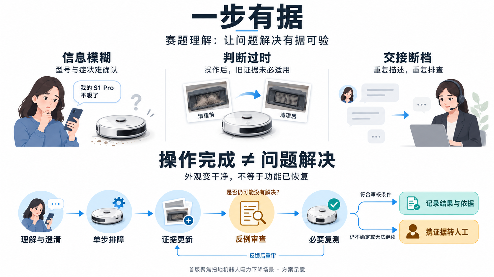
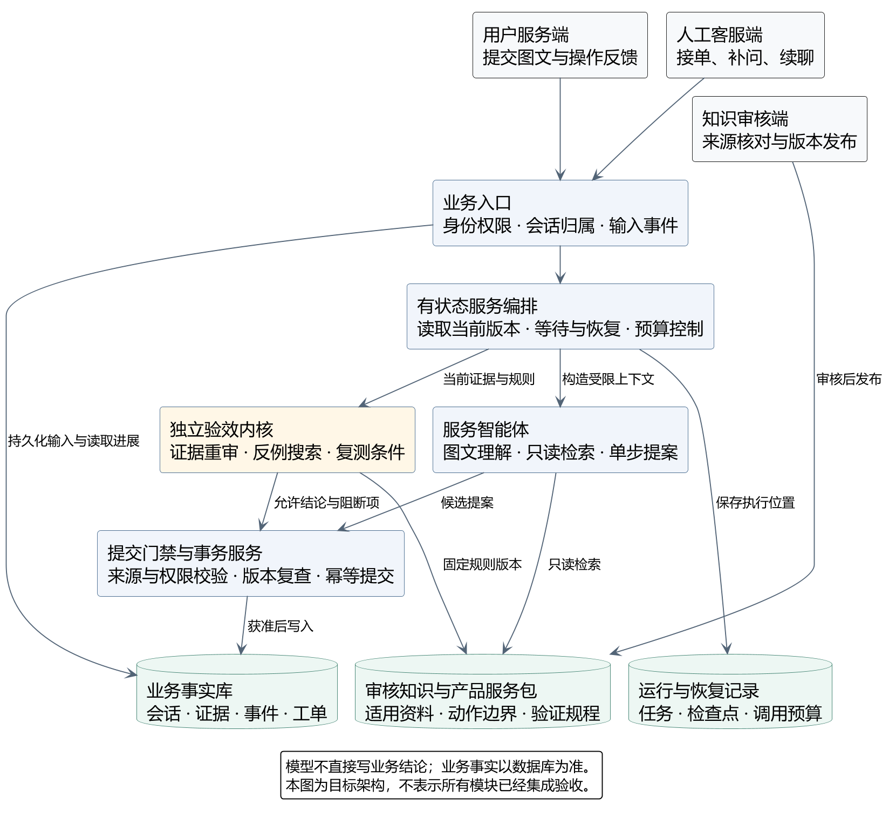

# 一步有据 | Yibu Youju

**面向售后服务的证据驱动智能体研究：理解求助、单步处理、更新证据、必要复测、携证据转人工。**

> 当前发布的是研究机制、工程基线与详细开发计划，不是已完成的售后产品。真实模型、完整业务闭环和实机验证尚未验收；本仓库不是 Anker 官方项目，也不代表品牌背书。

## 核心问题

操作完成不等于问题解决。照片变干净不能直接证明功能恢复，操作前的观察也不一定仍能支持操作后的结论。

本项目拟将服务智能体的候选理解与独立规则验证分离，研究三项相互关联的机制：

1. **多模态理解与主动澄清**：先确认产品与适用资料，再提出有来源的单步建议。
2. **动作感知的证据更新与反例驱动复测**：重审受操作影响的旧证据，检查是否仍有相容的未解决情况。
3. **分级结果与真实人工接续**：区分自述、观察与规程支持；转人工须对应服务单和实际接单事件。



上图为 AI 生成的方案示意，不是产品实拍、实际界面或测试证据。设备外观与操作步骤不构成维修指导。

## 本次开放内容

| 内容 | 路径 | 状态与边界 |
| --- | --- | --- |
| 有限状态机制研究 | [research](research/README.md) | 3 个布尔变量、8 个合成状态、20 项单元测试；不是真实设备诊断模型 |
| 前后端工程基线 | [baseline](baseline/README.md) | 保留 FastAPI 上游应用源码、锁文件和隔离 G0 验证入口；登录与示例 Item 不是售后功能 |
| 技术与智能体设计 | [技术方案](docs/technical-design.md)、[Agent 设计](docs/agent-design-v8.md) | 目标设计与接口边界，未实现能力保持明确标注 |
| 逐项开发清单 | [development-checklist.md](docs/development-checklist.md) | 41 个工作包、205 个子项；完成并有验证记录才勾销 |
| 科研复核与评审记录 | [科研复核](docs/research-review.md)、[评审记录](docs/review-decisions-v8.md) | 已知限制、反例、研究假设与验收方法 |
| 图文方案与图源 | [详细方案](docs/detailed-proposal.md)、[架构图](docs/diagrams/README.md) | 4 张 PlantUML 技术图及可编辑源文件；2 张已标注 AI 概念图 |
| 文献与来源 | [references.md](docs/references.md)、[第三方声明](THIRD_PARTY_NOTICES.md) | 区分研究参考、计划组件和实际复用代码 |

## 快速复现研究测试

研究部分仅使用 Python 标准库，Python 3.10 或以上即可；不需要 Docker、GPU 或模型密钥。

```bash
git clone https://github.com/Ring0321/yibu-youju.git
cd yibu-youju
python -m unittest discover -s research -p "test_*.py" -v
python scripts/check_publication.py
```

测试覆盖旧证据失效、同源观察、执行不确定性、冲突、未知范围和反例驱动检查选择。测试通过仅支持合成模型内的机制行为，不支持真实产品修复率或真实用户效果声明。

工程基线使用不同的依赖要求，参见 [baseline/README.md](baseline/README.md)，不要将研究测试的 Python 版本要求套用到整个前后端工程。

## 目标架构



服务智能体生成候选提案，独立验证内核检查证据与结论边界，提交服务校验权限、版本与控制权后才写入业务事实。上图为目标架构，不表示各模块已经接通。

## 开发状态与贡献

- 当前可核查状态及证据边界：[项目状态](docs/status.md)。
- 完成一项、验证一项、勾销一项：[开发清单](docs/development-checklist.md)。
- 历史估算与工程复用取舍：[实施计划 v7](docs/implementation-plan-v7.md)。更新设计优先参考 v8，执行状态参考 v9。
- 贡献与安全要求：[贡献说明](CONTRIBUTING.md)、[安全说明](SECURITY.md)。

团队分工：李鑫（队长）负责统筹、架构与后端；翁子衡负责智能体、证据机制与评测；张睿佟负责前端体验、联调与流程验证。

## 许可与使用边界

项目新增代码及文档采用 [MIT License](LICENSE)，上游代码保留原版权与许可证，详见 [THIRD_PARTY_NOTICES.md](THIRD_PARTY_NOTICES.md)。本仓库不包含企业私有知识、真实用户工单、模型权重或模型 API 凭据。商标、外部论文及链接资料不因本仓库许可而重新授权。

当前内容适合研究、复现与开发，不应直接用于对外提供自动维修结论。赛事是否允许赛前代码复用，仍须以主办方规则为准。
