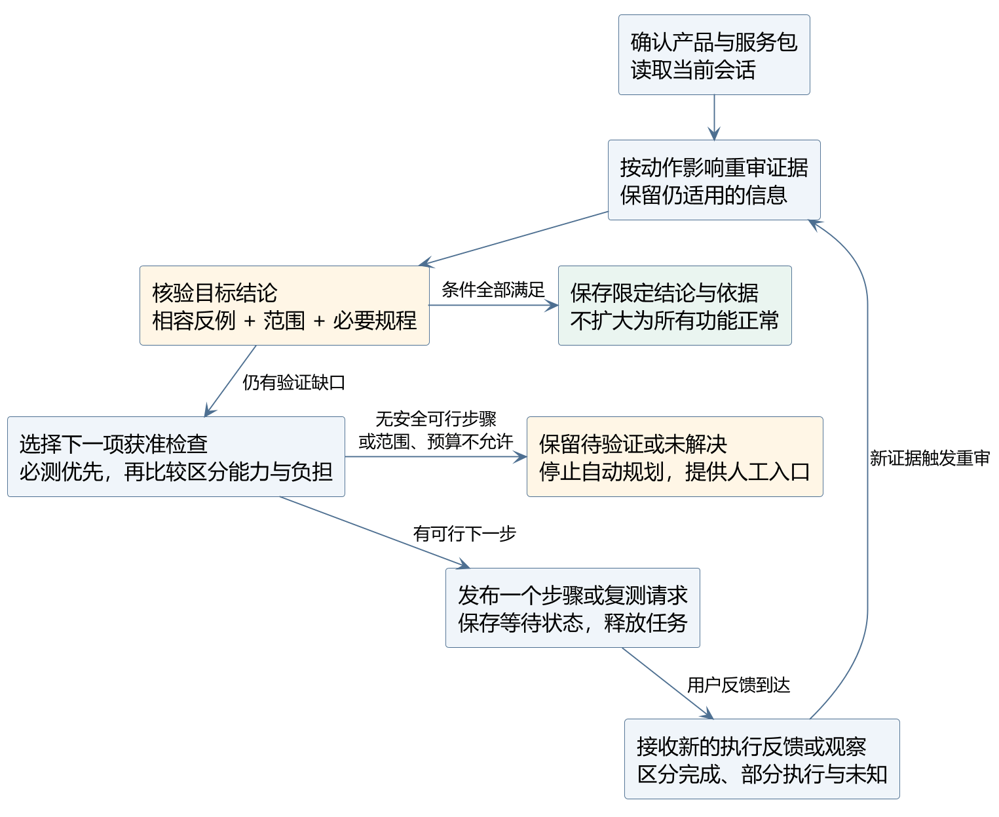
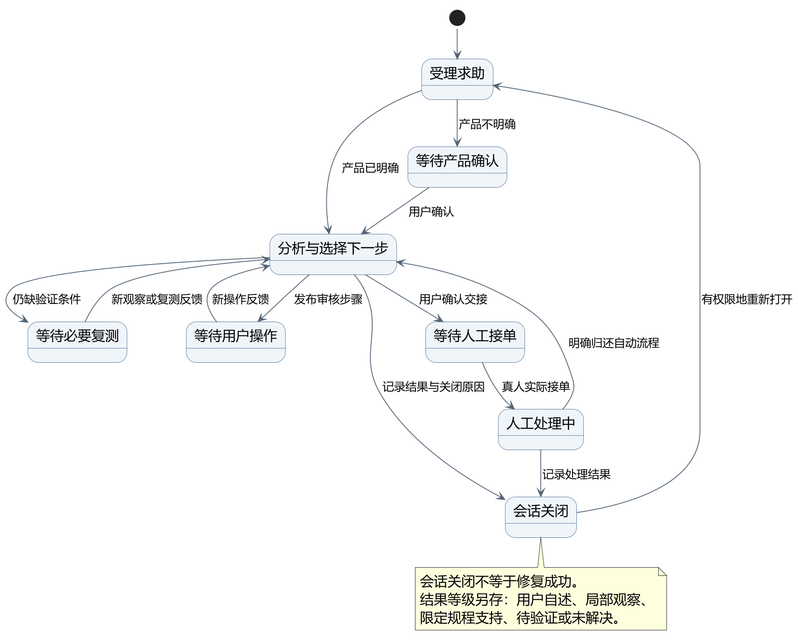
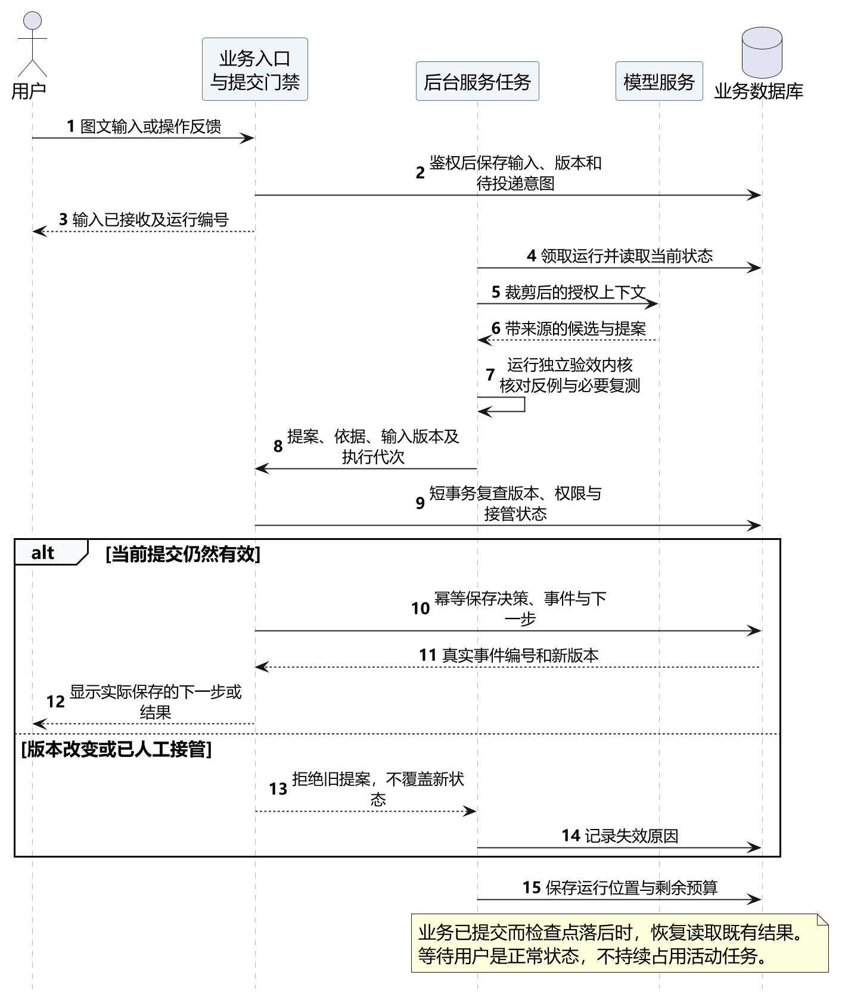
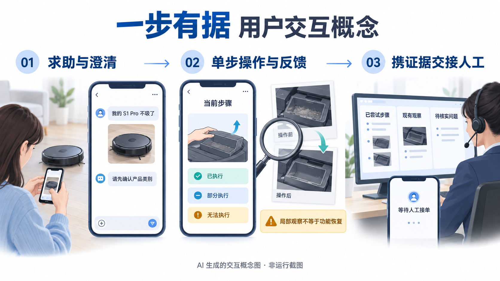

> 公开归档说明：本文保留原版本的研究和计划口径，不代表功能已经实现。当前状态见 [项目状态](status.md)，论文与技术依据见 [参考文献](references.md)。未公开的本机证据不作为公开可复核附件。

# 一步有据具体方案说明

智能服务赛道预赛技术方案详版

文档版本：v1　|　编制日期：2026-09-27

## 2.1 方案定位与核心主张

“一步有据”面向真实售后求助，拟构建由**多模态服务智能体、独立验效内核与人工接续机制**组成的服务系统。首版聚焦 S1 Pro 扫地机器人吸力下降场景，把零散描述和故障照片转为带来源的信息，按当前证据提供一个可执行步骤，再根据新反馈判断是否还需要复测或人工处理。

本方案的核心问题是：**用户完成了操作，是否就有足够依据认定问题已经解决？** 系统不把“照片看起来干净”“用户点击完成”或“对话结束”直接等同于设备恢复，而是持续检查证据是否仍适用、是否存在与现有观察相容的未解决情形，以及必要验证条件是否满足。

图1　问题与价值主张概念图。AI 生成的方案示意，不是实际产品照片、运行截图或效果证明。

**三个核心功能：** 多模态理解与主动澄清；动作感知的证据更新与反例驱动复测；分级结果与带证据的人工接续。创新集中在这三者的协同，而不是模型或框架数量。

**文档使用范围：** 本文是拟实现方案和开发契约的详细说明。架构、接口及交互图表达目标设计；已完成情况单列于第 2.12 节。真实模型、物理规程与整体验收未通过的部分，不表述为已经上线或已经验证。

<!-- PAGE -->

### 2.1.1 场景边界与用户需求

目标用户首先是遇到设备异常、缺少产品术语、希望尽快恢复使用的消费者；其次是需要理解前序处理过程的售后客服。用户可能只说“S1 Pro 不吸了”，也可能上传局部照片并表达急迫需求。系统既要减少反复问答，也要防止根据片面信息给出错误操作或过度肯定的结论。

首版只做一个可验收的服务纵向闭环：求助受理、产品确认、已审核范围内的单步指导、操作反馈、证据复核、分级结果和内部人工服务单。遇到同名的其他产品，系统可以澄清和转交，但不进入未经审核的维修路径。

| 业务问题 | 对用户和客服的影响 | 本方案的对应机制 |
| --- | --- | --- |
| 产品与症状描述模糊 | 选错资料、答非所问、重复解释 | 图文候选提取、产品确认、最小必要澄清 |
| 旧照片与新操作混用 | 把操作前信息误当成当前状态 | 记录时间与作用范围，按动作影响重审证据 |
| 操作完成被当作修复成功 | 漏掉仍未排除的故障，过早关闭 | 相容反例检查、必要复测、结论分级 |
| 转人工只转聊天窗口 | 用户重新叙述，客服重复排查 | 带来源的交接单、真实接单事件、控制权转移 |

### 2.1.2 原型包含什么、不包含什么

原型包含真实会话存储、图片上传、获准知识检索、受限模型调用、可恢复的服务流程和独立客服账号。页面上的进度、下一步、结果和接单状态必须来自后端保存的事件，而不是前端定时播放的演示脚本。

原型不承诺自动修复硬件，不包含设备内部拆修、危险操作、自动退款或质保裁决，也不假设拥有 Anker 私有订单或工单接口。内部客服是本项目的演示或试用人员，不能被标注成官方授权售后。订单查不到只表示本次查询无结果，不能据此否认购买事实或保修权益。

### 2.1.3 AI 与业务规则的分工

AI 处理口语、图片和多轮上下文中的开放性信息，提出候选解释与下一步交互；独立程序负责来源与权限校验、证据适用性、有限状态反例检查、必要规程判断及事务提交。用户负责确认产品和报告真实执行情况；有权限的人工负责接续服务及职责范围内的最终处置。

这一分工允许系统在信息不完整时继续服务，但要求明确表达未知，不依赖模型自我确认来消除不确定性。

<!-- PAGE -->

## 2.2 总体架构与技术路径

采用**模块化单体后端、关系数据库和可恢复后台任务**作为首版工程形态。用户端、客服端和知识审核端共享经过鉴权的业务接口；智能体产生提案，验效内核给出允许范围，提交服务才有权改变业务事实。

图2　系统目标架构。由 PlantUML 源码生成；箭头表示调用、读取或提交关系，不代表模块已完成集成。

数据库保存会话、证据、操作、决策和工单，是业务事实的唯一权威来源。运行检查点只记录执行位置与业务记录引用，不能成为一份可以独立覆盖数据库的“另一套真相”。

<!-- PAGE -->

### 2.2.1 模块职责与数据流

| 模块 | 输入与职责 | 输出及边界 |
| --- | --- | --- |
| 业务入口 | 登录身份、图文求助、产品确认、操作反馈 | 保存合法输入，生成事件与运行编号；不接收客户端自授角色 |
| 服务智能体 | 裁剪后的会话、获准证据、知识片段、可选动作 | 带来源的候选信息与单步提案；不直接写结论 |
| 独立验效内核 | 已审核服务包、当前证据、操作执行状态 | 证据失效原因、相容反例、必要检查、可支持等级 |
| 提交门禁 | 智能体提案、内核结果、权限与会话版本 | 接受、拒绝或要求补充；通过后原子提交业务事件 |
| 流程与任务层 | 输入事件、等待恢复事件、任务租约与预算 | 有限重试、断点恢复、状态通知；等待用户不占用活动任务 |
| 知识与服务包层 | 官方资料、人工审核规则、发布版本 | 可追踪片段、允许动作、检查协议与测试夹具 |
| 人工工作台 | 待接单、交接摘要、历史观察与疑点 | 接单、补问、处理记录和明确的控制权交还 |

### 2.2.2 复用已有技术的方式

基础能力复用成熟的身份认证、数据库迁移、结构化校验、可持久化流程、后台任务和文件存储机制。检索采用产品过滤后的关键词与语义召回；界面采用已有表单、上传与状态展示组件。这些能力降低基础工程成本，但不作为项目原创算法申报。

项目自行定义并实现的核心业务机制包括：证据适用范围、动作影响映射、相容反例枚举、必要复测约束、结论等级、人工接管门禁和服务包契约。通用基础设施与领域机制通过明确接口连接，避免把多个现成系统整套拼接后出现权限、状态和数据源冲突。

### 2.2.3 技术选择与落地约束

后端延续现有 Python 业务工程，利用类型化数据结构校验模型输出；关系数据库承载会话与事件；前端延续已有 Web 工程，不再另建一套独立展示站。首版优先数据库支持的任务投递和恢复，暂不因概念完整性额外引入多个消息系统或图数据库。

模型通过统一网关接入，固定供应商、地区、版本、超时与调用预算。图文理解和结构化提案必须用真实账号分别验证；候选模型写入配置不等于已经可用。若模型不可用，应展示受理状态和人工入口，不能静默切换成假回复并继续声称智能体正常工作。

<!-- PAGE -->

## 2.3 核心功能一：多模态理解与主动澄清

### 2.3.1 做什么

将文本描述、故障图片和用户反馈转为可以继续处理的服务信息，识别产品候选、症状、已尝试步骤和当前操作限制。对“S1 Pro 不吸了”这样的输入，先区分产品类别；对一张只能看见局部的照片，只记录能被图像支持的观察，不能推断整机功能状态。

### 2.3.2 怎么做

**第一步，安全接收。** 后端校验会话归属、图片实际类型、大小和数量，保存原始输入与文件摘要。图片以受控引用供模型读取，不把用户任意输入的网址作为可自由抓取的地址。原图、识别结果和后续修订分别留存，避免覆盖来源。

**第二步，提取候选信息。** 图文模型按固定结构输出产品候选、症状片段、图片可见观察、用户自述动作、执行状态和需要澄清的字段。每个候选绑定消息编号或图片编号。无法读清的型号、看不到的部位和未经验证的因果关系必须保留未知。

**第三步，检查一致性。** 产品目录、用户确认和图片候选发生冲突时，不采用“最后一条覆盖前面所有信息”。系统显式记录冲突并补问；如果资料适用型号尚未确定，排障动作暂不放行。

**第四步，选择最少的必要问题。** 澄清优先解决会改变处理分支的信息，例如产品类别、是否确为当前设备、照片是否摄于操作之后。已被可靠确认且未失效的信息不重复询问。信息需求与提问理由保存到事件中，便于评估无效问答。

| 候选字段 | 合法来源 | 后续处理 |
| --- | --- | --- |
| 产品类别与型号 | 原文、铭牌图片、用户确认 | 候选匹配后确认；不直接以模型置信分数放行 |
| 症状与发生时间 | 用户原话、后续补充 | 保留原文和结构化摘要，未知时间不补造 |
| 已尝试步骤 | 用户描述、已发布步骤的反馈 | 区分已执行、部分执行、未执行和未知 |
| 局部可见现象 | 指定图片及可见区域 | 仅支持对应局部观察，不升级为性能结论 |

### 2.3.3 AI 的具体作用与用户体验

AI 将口语和图片转为候选事实，解释为什么需要补充某项信息，并根据用户明确表达的焦急、时间限制或操作困难调整语气和信息量。例如用户马上要出门，系统可以优先询问能改变当前选择的一个问题，并提供保存进度或人工入口；不能为了缩短流程跳过安全要求。

<!-- PAGE -->

### 2.3.4 知识检索与来源约束

知识处理遵循“先确定适用范围，再检索内容”。资料入库时记录产品、型号、地区、版本、发布来源、章节位置、审核人和审核状态。只有当前会话适用且已发布的资料进入候选集合；之后再进行关键词召回、语义召回和相关性排序。

检索结果保留原文片段和来源定位，不只返回一段无法追溯的综合答案。设备操作必须映射到服务包中已经审核的动作编号，不能因为某段网页文字相似就直接生成新的维修步骤。公开资料用于形成审核依据，不等于已获得完整功能验收规程。[R1]

当没有适用资料、资料互相冲突或当前型号版本不在覆盖范围内时，系统输出资料缺口并转向澄清或人工。不能退回无来源的常识回答后，继续沿用“已审核指导”的标识。

### 2.3.5 澄清过程示例

以下为交互脚本设计，不是实测对话，也不构成具体设备维修指导。

1. 用户：“我的 S1 Pro 不吸了，明天家里有客人。”系统保存症状与用户明确表达的时间压力，保留两个可能的产品类别。
2. 系统：“先确认一下，是扫地机器人还是其他设备？”用户选择扫地机器人。系统保存确认事件，绑定相应产品服务包。
3. 用户上传局部照片。AI 将可见内容标为候选观察，系统仍保留未拍到的区域为未知；照片模糊时说明需要补拍的对象，而非连续要求用户重新上传整套信息。
4. 系统只提出一个已获准且符合前提的检查或操作；用户可以报告完成、部分完成、无法执行或仍有异常，随后进入证据复核。

### 2.3.6 失败处理与验收判据

| 失败或特殊输入 | 期望系统行为 | 验收证据 |
| --- | --- | --- |
| 同名产品、缺少类别 | 先澄清，不进入错误产品排障路径 | 事件记录、适用服务包与界面结果一致 |
| 模糊图、遮挡图、无关图 | 标记不可判定，提出有目的的补充请求 | 不生成图片中不存在的具体事实 |
| 图片与用户描述矛盾 | 保存冲突，不直接认定一方真实 | 保留两类来源和冲突处理记录 |
| 知识无命中或未审核 | 不发布无来源维修动作 | 动作提案被门禁拒绝，展示明确原因 |

功能验收应使用事先冻结的输入集，记录产品误分支率、必要澄清覆盖和重复提问次数；不能只用几条精心编写的正常输入证明“真正听懂”。

<!-- PAGE -->

## 2.4 核心功能二：证据更新与反例驱动复测

### 2.4.1 做什么

在每次操作之后回答两个问题：过去的证据还能支持现在的判断吗？即使这些证据都成立，是否仍可能没有解决问题？只有来源、时效、适用范围和必要规程共同支持时，系统才给出对应等级的结果。

例如，操作前照片显示某处存在可见杂物；用户随后报告完成了清理。旧照片仍是历史记录，但不应继续被用作“当前位置仍有杂物”的直接依据。与此同时，“已清理”的自述也不足以证明装配状态或实际吸力已经恢复。

### 2.4.2 证据记录的最小结构

| 字段组 | 建议内容 | 用途 |
| --- | --- | --- |
| 身份与范围 | evidence_id、case_id、device_id、部位与适用判断 | 防止跨设备、跨会话和跨结论误用 |
| 来源与时间 | 消息或图片引用、采集时间、接收时间、来源类型 | 区分原始记录、用户自述与模型候选 |
| 内容与状态 | 观察候选、确认情况、适用性、冲突标记 | 不以一个通用“置信度”代替所有判断 |
| 影响与版本 | 关联动作、失效原因、规则版本、替代证据 | 操作后只重审受影响的判断，保留历史 |
| 验证条件 | 检查协议、前提、结果类别、无效原因 | 支撑通过、失败、无效或待验证的区别 |

### 2.4.3 动作感知的更新规则

每个获准动作定义适用前提、可能影响的状态变量、需要重新检查的证据类型和安全停止条件。用户报告动作完成后，系统将可能受影响的“当前状态判断”重新置为待核实，而不是把该动作的理想效果直接写为事实。

执行反馈必须包含明确枚举。部分执行只触发相应范围的重审；无法执行不算失败维修，也不触发理想效果；执行情况未知时保留多种可能。对未被动作影响且来源仍可靠的信息，可以继续使用，避免用户每轮重拍所有材料。

**本功能的关键创新是证据的适用性随动作变化，而非简单累计聊天记忆。** 记得更多并不必然判断更准；系统需要知道哪些历史信息只能解释过去、哪些仍可支持当前结论。

<!-- PAGE -->

### 2.4.4 验效闭环流程

图3　动作、证据、反例与复测闭环。由 PlantUML 生成；入口前提为产品确认和服务包获准。

图中“证据与规程支持”指当前目标结论的全部必要条件，不是模型给出一个高置信回答。每次反馈后重新核验；进入等待状态时保存进度、释放任务，用户返回后再以最新业务版本恢复。

若没有安全、获准且可执行的下一步，或范围、预算不再允许继续，系统保留未决结果并提供人工入口。它不为了形成漂亮的成功路径而不断追加检查。

<!-- PAGE -->

### 2.4.5 相容反例的可实现算法

首版使用经审核的小规模有限状态模型，不尝试让大模型建立完整物理世界。模型描述服务包覆盖的候选状态、观察条件和目标结论。对当前仍有效的证据，程序筛选出与这些证据不矛盾的状态；其中只要存在目标结论不成立的状态，就形成一条需要解释或排除的相容反例。

可将判断写为：**相容反例集合 = 满足当前证据约束、但不满足目标结论的已建模状态集合。** 反例结果应返回关联状态、证据约束和仍缺的检查，而不是只给出“通过/不通过”。规模较小时直接枚举，配合固定测试夹具即可实现，无需首版引入复杂求解平台。

没有找到反例不自动等于真实设备正常。还必须确认当前输入在模型覆盖范围内、证据之间没有未处理冲突、必要规程已经完成且有效、目标结论符合许可等级。相容状态集合为空时可能是证据冲突或模型不适用，绝不能利用“空集上没有反例”宣布修复。

### 2.4.6 如何选择下一项检查

先执行硬过滤：产品和版本适用、步骤已审核、风险可接受、用户可执行、所需前提满足。必要规程项具有优先级，即使不会明显增加区分信息，也不能省略；只有在允许选择的检查之间，才比较区分能力和用户负担。

首版可以根据有限状态模型模拟每项检查可能产生的结果，比较其对候选状态集合的划分情况，同时考虑预计操作时间、重复次数和用户限制。排序权重属于待调参数，需在冻结测试集上比较；没有可靠概率时不伪造概率，也不声称获得全局最优排障路径。

### 2.4.7 示例与结论边界

| 当前信息 | 仍需考虑的可能性 | 允许的处理 |
| --- | --- | --- |
| 用户说“已经清理了” | 执行范围不明或效果尚未观察 | 记录自述，询问必要反馈，不宣告恢复 |
| 新照片显示局部无明显杂物 | 其他影响功能的状态尚未知 | 仅记录局部可见观察，检查必要规程 |
| 用户说“现在感觉好了” | 缺少适用功能验证条件 | 标为用户反馈恢复，保留证据等级 |
| 限定规程有效通过 | 未覆盖的功能仍未验证 | 仅支持规程定义的目标，不扩展为整机正常 |

上述例子说明信息关系，不替代官方操作说明。本项目尚无已通过审核的完整物理验证规程时，必须关闭“限定规程结果支持”路径，保留自述、局部观察、待验证或人工处理。

<!-- PAGE -->

## 2.5 核心功能三：分级结果与人工接续

### 2.5.1 做什么

让用户清楚知道“目前确认了什么、还不能确认什么、下一步由谁处理”。系统将服务流程状态与设备判断分开保存，避免把用户离开、会话关闭或工单创建当成问题解决。

| 结果类别 | 必要依据 | 可表达的范围 |
| --- | --- | --- |
| 用户反馈恢复 | 用户明确陈述当前体验改善 | 仅代表用户自述，不称为客观验收 |
| 局部观察支持 | 对应部位、时间和来源的可见证据 | 只描述局部，不推断整体功能 |
| 限定规程结果支持 | 获准协议、必要条件、有效结果及适用范围 | 仅支持协议定义的目标功能与条件 |
| 待验证或未解决 | 缺少必要检查、检查未通过或无可行下一步 | 说明具体缺口或失败结果，提供接续选择 |
| 冲突或超出范围 | 来源矛盾、异常不在审核模型覆盖内 | 停止扩大自动结论，交由人工核实 |

### 2.5.2 带证据的交接单

交接内容由真实记录生成，包含已确认产品、主要症状、用户限制、已发布步骤及执行反馈、当前证据、无效或失效原因、未排除情形和待核实问题。每个事实性摘要指向原始消息、图片、操作或决策事件，客服可以追溯而不必重新询问全部经过。

AI 负责压缩历史和组织语言；程序检查摘要引用是否属于当前会话、是否仍有效，以及是否把自述升级成客观结论。无法验证的摘要条目退回原始记录或标注待核实，不允许以语言润色掩盖信息缺口。

### 2.5.3 从预览到真实接单

用户先查看交接预览，再确认提交。确认必须绑定预览内容摘要、提案编号、会话版本和有效期，避免用户同意旧内容后系统转交另一份材料。后端创建内部服务单后显示“等待人工接单”，只有另一个有权限的客服账号实际接单，才显示“人工处理中”。

接单事件同时改变服务控制权，暂停 AI 自主发布设备操作。客服可以补问、查看原始证据并记录结果；需要返回自动流程时必须显式交还控制权。无人值守、接单失败或网络中断都应真实展示，不能播放预设成功动画。

<!-- PAGE -->

### 2.5.4 服务状态与控制权

图4　服务状态转换。由 PlantUML 生成；会话关闭与设备结果等级独立，重新打开仍需权限校验。

“等待用户操作”和“等待必要复测”是正常暂停状态，而非后台任务卡死；“等待人工接单”不表示已经有人处理。客服接管之后，迟到的模型响应必须被拒绝提交。

用户中途退出后可返回原会话。恢复时重新读取当前版本、服务包和控制权，不直接重播旧消息中的下一步。若会话已经关闭，应通过有权限的重新打开操作形成新事件，而不是在旧状态上静默继续。

质保、退款和官方维修安排不在自动裁决范围。涉及上述事项时，交接单提供已收集材料和查询记录，由具有相应职责的人或经授权业务系统处理。

<!-- PAGE -->

## 2.6 智能体执行协议

### 2.6.1 一个服务智能体与独立控制内核

采用一个面向用户的服务智能体承担理解、检索、提案与解释，避免首版引入多个大模型互相投票来制造确定性。验效内核、提交门禁和业务事务是独立程序模块，不是换个提示词的“另一个审查智能体”。

智能体每次运行收到服务器构造的 AgentContext，包含当前会话和设备引用、业务版本、控制代次、固定服务包版本、来源明确的信息、允许的动作编号、待补字段和剩余预算。身份、组织归属和权限由服务端绑定，模型和客户端都无权自行扩大。

### 2.6.2 提案结构与提交结果

| 契约对象 | 核心字段 | 强制检查 |
| --- | --- | --- |
| AgentContext | case_id、case_version、control_epoch、pack_version、allowed_action_ids、evidence_refs、budget | 来源和权限由服务器构造；仅包含当前任务所需信息 |
| AgentProposal | proposal_id、proposal_type、source_refs、action_id 或 question_id、用户说明、未确定项 | 严格类型、枚举、引用归属与动作白名单；一轮只发布一个物理步骤 |
| ExecutionOutcome | gate_status、decision_id、committed_event_id、case_version、result_grade、error_code | 只有实际提交成功才返回成功事件；拒绝不能伪装成完成 |

提案类型包括澄清、获准单步指导、请求复测、交接预览或解释当前状态。结果等级受内核与规程控制，不接受模型通过自由文本自创“已修复”状态。所有对用户发布的操作参数来自获准服务包，语言改写不得改变安全条件和操作含义。

### 2.6.3 工具与预算边界

模型只能调用获准的产品查找、已审核知识检索和交接预览工具；这些工具默认只读。数据库写入、工单创建、控制权变化和状态关闭由提交服务执行。首版不开放任意网页访问、系统命令、自由 SQL 或跨用户查询。

候选初始预算沿用执行设计：正常运行最多两次模型调用，仅允许一次受控结构修复，硬上限三次；只读工具调用最多四次。初始执行期限和单次请求超时分别为 90 秒、45 秒，属于待压力测试的配置，不是已验证响应承诺。重试共享原预算和截止时间，不能重新计数形成无限循环。

<!-- PAGE -->

### 2.6.4 一次输入的可靠执行时序

图5　输入、模型提案、独立核验与事务提交时序。由 PlantUML 生成，成功消息以实际提交事件为依据。

输入先持久化，再投递任务；调用模型期间不持有长数据库锁。提交前重新检查会话版本、运行代次和人工控制权。模型响应再完整，只要对应的业务状态已经改变，也不能覆盖新结果。

<!-- PAGE -->

## 2.7 数据模型与接口契约

### 2.7.1 核心业务实体

| 实体 | 保存内容 | 关键一致性约束 |
| --- | --- | --- |
| Case 与 Message | 会话归属、产品确认、原始消息、状态与版本 | 每次业务改变推进版本；不能跨用户读取 |
| Asset 与 Evidence | 文件摘要、受控地址、来源、候选观察、适用性 | 文件引用必须合法；历史证据不被覆盖删除 |
| Action 与 Report | 获准动作、参数、发布依据、执行反馈 | 发布与执行分离；反馈不能伪装成理想效果 |
| Check 与 Result | 协议版本、前提、通过/失败/无效、证据 | 必测项不省略；无效结果不能计为通过 |
| Proposal 与 Decision | 模型提案、来源、核验结果、拒绝原因 | 一个提案绑定输入版本；提交结果可追溯 |
| Run 与 Event | 租约、运行代次、预算、顺序事件、检查点引用 | 恢复不覆盖业务事实；旧任务失去提交权 |
| Ticket 与 Handoff | 预览、用户确认、接单者、处理与交还记录 | 创建不等于接单；接管与自动控制互斥 |
| ServicePack 与 Source | 产品范围、允许动作、规程、审核与版本 | 发布版本固定；撤回和替换有记录 |

### 2.7.2 事件、版本与幂等

重要改变均形成结构化事件，包括产品确认、动作发布、动作反馈、证据重审、复测提交、结果形成、交接创建和人工接管。事件记录发生者、发生时间、关联实体和版本；界面从事件流或其投影恢复，不以浏览器本地状态替代业务事实。

写请求携带预期版本与幂等键。相同幂等键和相同内容重试时返回已保存结果；相同键对应不同内容时返回冲突。权限、版本和写入在短事务中核验，必要时采用条件更新或行锁；不能仅凭数据库的默认隔离级别假定不会出现并发覆盖。[R3]

如果提交已成功但网络响应丢失，客户端通过运行编号或事件编号查询结果，不再次执行物理步骤。对未来接入的外部写操作，超时应视为结果未知并进行核对，不能盲目重复提交。

### 2.7.3 服务包为何可以复用

服务包将产品适用范围、知识引用、状态变量、允许动作、动作影响、观察映射、必测规程、停止条件、交接条件和回归用例封装为版本化配置。通用编排与验效程序只读取契约，不把某个型号的规则散落在提示词和前端页面里。

接入新产品需要补齐资料、完成领域审核和物理验证，再运行同一套契约测试。复用的是技术机制和验收方法，不是未经验证地复用某款产品的故障判断，也不承诺任意新品零代码上线。

<!-- PAGE -->

### 2.7.4 拟实现 API 清单

以下为目标接口契约，不表示这些路由已完成开发。会话和工单标识必须在服务端进行归属与角色校验，不能只验证编号存在。

| 接口 | 用途 | 返回与限制 |
| --- | --- | --- |
| POST /api/v1/cases | 创建会话 | case_id、版本和初始状态 |
| POST /api/v1/cases/{id}/messages | 提交求助或补充信息 | 输入事件与运行编号；不提前返回诊断成功 |
| POST /api/v1/cases/{id}/assets | 上传受控图片 | 文件引用与校验状态 |
| POST /api/v1/cases/{id}/product-confirmations | 确认产品 | 产品绑定事件与新版本 |
| POST /api/v1/actions/{id}/reports | 报告操作执行情况 | 执行枚举、来源与后续运行编号 |
| POST /api/v1/checks/{id}/results | 提交复测信息 | 结果待核验，不能由客户端自授通过 |
| GET /api/v1/cases/{id} | 恢复当前进度 | 数据库中的当前状态和可执行操作 |
| GET /api/v1/cases/{id}/events | 获取增量事件 | 按游标读取，断线后补齐，不重复显示 |
| POST /api/v1/cases/{id}/handoffs | 确认交接并建单 | 验证预览与版本，返回真实服务单 |
| POST /api/v1/tickets/{id}/accept | 客服实际接单 | 角色校验、接管事件与新控制代次 |
| POST /api/v1/tickets/{id}/messages | 人工补问与回复 | 原始消息与发送者身份 |
| POST /api/v1/tickets/{id}/resolutions | 记录人工处理结果 | 处理内容与依据；不自动提升客观等级 |

知识导入与服务包发布另设管理员接口，发布前检查来源、必填规程和测试记录。导入成功不等于审核通过；撤回版本后，新会话不得继续使用，进行中的会话需要明确迁移或停止策略。

### 2.7.5 错误与界面反馈

统一错误对象包含 code、message、retryable 和 trace_id。会话版本过期返回冲突并提示刷新；无权限与不存在必须按隐私策略返回，不伪装成“知识没有答案”。图片校验失败、模型超时、队列过载和规程缺失分别使用可理解的状态说明。

后台错误详情与密钥、原始敏感图片、内部提示词隔离。面向用户展示恢复方式和当前已保存内容；面向运维记录追踪编号、模块、预算和脱敏原因，便于排查而不泄露数据。

<!-- PAGE -->

## 2.8 用户端与客服端交互

图6　求助、单步反馈与人工交接的交互概念。AI 生成，非真实运行截图；设备外观仅作示意。

### 2.8.1 用户端最小可用页面

以当前会话为主界面，显示图文消息、产品确认、当前唯一待办、操作反馈、处理进度和人工入口。证据来源与判断说明可展开查看，避免一次给用户展示完整技术推理。图片上传必须具备真实进度、失败重试和删除未提交附件的状态。

操作按钮区分“已执行”“部分执行”“无法执行”，必要时补充仍有异常的描述。点击完成仅保存执行反馈，不能直接触发绿色“修复成功”页面。返回会话后从服务器恢复已保存内容，重复点击不会重复创建操作或工单。

### 2.8.2 客服端最小可用页面

包括待接队列、服务单详情、证据时间线、未决问题和消息区。队列区分等待接单、本人处理中和已关闭；客服实际接单后才获得该服务单的处理控制。接单成功、接单冲突和会话已被他人处理必须分别呈现。

交接摘要不是聊天全文的另一种堆积。默认显示已尝试步骤、失败或无效结果以及待核实问题，点击后追溯原图或原话。客服修改总结时保留修改者与时间，不能无痕改写原始证据。

### 2.8.3 贯穿演示路径

演示从一句模糊求助开始，由真实模型提出产品澄清；上传实际测试图片后给出候选观察；用户报告单步执行，系统重审证据并保留待验证；随后确认交接，由另一账号接单并查看完整来源。演示同时展示后端事件记录，以证明页面状态与真实业务一致。

如果演示时尚无获准功能验证规程，应选择“局部观察支持、仍待验证、人工接续”的诚实路径，而不是预制一个并不存在的修复成功结果。

<!-- PAGE -->

## 2.9 可靠性、安全与隐私设计

### 2.9.1 任务恢复与并发控制

输入记录与待投递意图在同一事务中持久化，后台任务按租约领取运行。运行记录包含任务代次、剩余预算、截止时间和最近心跳；重启恢复后先读取业务状态，避免把已经提交的结果再执行一遍。模型调用位于事务之外，提交时再次校验版本和控制权。

需要用户反馈时保存等待位置并结束当前活动任务。持久化流程支持暂停与恢复，但恢复节点可能重新执行，因此发生副作用的命令必须置于可幂等的业务边界内。[R2] 本项目追求业务效果不重复，而不宣称外部模型调用天然“恰好一次”。

候选恢复策略最多两次自动恢复，并共享原运行预算；达到截止时间、任务代次过期或被人工接管后停止自动提交。队列容量和模型并发受控，超过负载时返回已受理或繁忙状态，不用更多重试放大拥堵。

### 2.9.2 模型与外部内容的安全边界

| 风险 | 约束措施 | 必测行为 |
| --- | --- | --- |
| 图片或文档夹带指令 | 附件和检索内容仅作数据；固定工具白名单 | “忽略规则”等文本不能改变权限或动作集合 |
| 来源编造与跨会话引用 | 引用必须存在、归属当前会话且范围适用 | 非法引用拒绝提交，不用相似编号补齐 |
| 越权工具调用 | 模型无自由 SQL、命令执行或任意网络能力 | 未列入工具表的调用不可执行 |
| 人工接管后的迟到输出 | control_epoch 与版本在提交时复核 | 不发布旧建议、不覆盖人工状态 |
| 重复请求与重放 | 幂等键、预览哈希、确认有效期 | 不重复建单；旧预览不能确认新内容 |

提示注入既可能来自直接输入，也可能来自检索材料；仅靠提示词声明并不能构成安全隔离。[R4] 因此权限、工具范围、参数校验和数据写入均由模型之外的程序执行。

### 2.9.3 数据最小化与留存

默认只采集处理当前故障所需的信息，提示用户避免上传人脸、家庭隐私或完整订单敏感字段。图片访问使用鉴权或短期受控链接；跨用户读取、下载和删除都单独校验。日志脱敏，模型密钥只保存在未提交的本机或部署配置中。

留存期限、删除流程、供应商数据处理设置和隐私告知需在正式试用前确认并配置。未确定的期限不写成既定合规结论；科研评测样本需获得适当授权并脱敏，不能直接公开用户原始故障照片。

<!-- PAGE -->

## 2.10 创新验证与评估方法

### 2.10.1 要验证的研究问题

本项目提出三个可检验问题：动作感知的证据更新能否减少旧证据误用？相容反例与必要复测能否减少无依据的恢复结论？带来源的交接能否减少人工接续时重复询问已经确认的信息？这些是待验证假设，不是已经获得的效果。

实验不能只与完全没有规则的聊天机器人比较。应使用同一基础模型、同一资料范围、相近工具预算和相同输入集，比较有竞争力的固定审核流程与逐步增强的方案，区分模型能力、规则约束和新增机制各自的贡献。

| 对照组 | 保留的能力 | 用于检验 |
| --- | --- | --- |
| A：固定审核流程 | 图文理解、审核知识、固定安全步骤与必测项 | 成熟规则流程的基础表现 |
| B：状态与证据更新 | A 的基础能力，增加动作影响和证据重审 | 旧信息重用和重复采集是否改善 |
| C：反例与检查选择 | B 加相容反例、可选检查排序和分级结果 | 是否减少无依据结论及不必要检查 |
| D：完整人工接续 | C 加来源化交接、真实接管与恢复 | 接续成本与状态一致性是否改善 |

### 2.10.2 指标定义

**无依据恢复判定率：** 未满足审核标准却输出相应恢复等级的案例数，除以有效测试案例数；同时报告错误个数和样本数。补充报告在所有恢复判定中的错误比例，避免分母变化掩盖问题。

**有效处理覆盖率：** 在授权范围内完成适用指导、形成有依据等级或正确交接的案例比例。必须与过度拒绝率、人工转交比例同时报告，防止系统通过全部拒绝来降低错误率。

**用户负担与接续成本：** 记录新增澄清次数、重复取证次数、检查次数、实际完成时间和人工重复问询次数。信息增益得分只是内部排序依据，不能替代真实负担测量。

**工程质量：** 测量模型调用次数、端到端延迟分布、失败恢复率、重复副作用数、越权提交数及单次有效会话成本。所有数值需注明环境、并发、样本和版本，不预填“提升百分比”。

### 2.10.3 评测数据与真实标签

机制测试使用可复现的合成状态和边界案例，只证明程序按规则运行；图文理解测试使用经核对的资料和标注；物理功能结论必须使用获准规程、实际设备和独立记录，不能让同一个生成模型给自己的答案打分作为真值。开发与测试样本分离，规则调整后重新冻结版本再评估。

<!-- PAGE -->

### 2.10.4 关键验收用例

| 编号 | 输入或故障注入 | 必须观察到的结果 |
| --- | --- | --- |
| V01 | 输入同名产品与模糊症状 | 完成产品澄清前不发布产品特定动作 |
| V02 | 上传模糊、无关或操作前照片 | 明确未知或时效范围，不输出不存在的可见事实 |
| V03 | 用户仅报告执行完成 | 记录执行状态，不能直接写成功能恢复 |
| V04 | 用户部分执行或无法执行 | 不应用完整动作效果，保留相应未知状态 |
| V05 | 局部外观正常但仍有相容反例 | 阻断对应恢复结论，给出具体未决项 |
| V06 | 必测项缺失但可选检查区分度为零 | 必测项仍保留，不能以“无需信息增益”为由跳过 |
| V07 | 证据互相冲突，相容集合为空 | 返回冲突或范围问题，不认定反例已全部排除 |
| V08 | 无获准物理规程 | 禁止更高功能等级，仍可保存自述与局部观察 |
| V09 | 用户确认交接，但尚无人接单 | 仅显示等待接单；第二账号操作后才变更状态 |
| V10 | 接管之后模型迟到返回 | 旧提案被拒绝，不覆盖人工处理 |
| V11 | 业务已提交但检查点落后，随后重启 | 读取既有结果，无重复操作发布或建单 |
| V12 | 重复请求、不同内容复用幂等键 | 同内容返回原结果，不同内容返回冲突 |
| V13 | 附件夹带越权指令或其他会话编号 | 不改变权限，不返回跨会话信息 |
| V14 | 关闭会话后有权限地重新打开 | 形成新事件并读取当前状态，不重播旧动作 |

上述用例是本文的重点摘录，不能替代主清单中完整的 28 项产品验收。每项需保存输入、固定版本、实际输出、数据库断言、前后端截图和通过依据；失败项继续保持未完成。

### 2.10.5 验收证据的分层

软件单元测试、集成故障注入、双账号端到端演示、真实模型回放和实机规程记录分别保存，不能互相代替。AI 概念图、静态原型图和预先编写的演示脚本不计为运行证据；人工检查过的真实截图应与对应会话和事件编号关联。

若测试发现某项机制没有增益，应保留结果并调整范围或简化设计。项目创新应由相对于强基线的可重复改进支持，而不是仅依赖术语命名或图表复杂度。

<!-- PAGE -->

## 2.11 实施顺序、团队分工与复用价值

### 2.11.1 按可运行的纵向闭环交付

| 阶段 | 实际交付物 | 进入下一阶段的条件 |
| --- | --- | --- |
| 1：前置验证 | 可构建工程、真实图文模型、可用资料、持久化与恢复实验 | 软件可行性门禁通过；权限和测试范围明确 |
| 2：受理与澄清 | 真实会话、图片、产品确认、获准检索、单步提案 | 界面与数据库一致；错误产品不能进入排障 |
| 3：证据与验效 | 动作反馈、适用性更新、有限反例、必要检查、分级结果 | 机制用例和边界用例通过；缺规程不放行 |
| 4：人工接续 | 预览确认、真实建单、独立账号接单、控制权切换 | 双账号闭环与迟到提案拒绝通过 |
| 5：演示与评估 | 固定版本、复现数据、回归结果、真实运行记录 | 完成所申报等级的逐项验收，而非只完成页面 |

### 2.11.2 三人分工

1. **项目统筹与后端：** 负责架构、业务数据、接口、版本与幂等、任务恢复、集成验收和答辩统筹。
2. **智能体与核心机制：** 负责模型接入、审核知识检索、证据与动作映射、相容反例、复测选择和对照评估。
3. **前端与体验验证：** 负责用户端与客服端、图片上传、单步反馈、进度恢复、双账号接单交互、接口联调和端到端演示材料。

以上为项目职责安排，不包含未经提供的学历、履历或技术经历。跨模块接口先共同确认；权限、证据等级和真实运行演示由三人交叉验收，不能由页面开发者单独以视觉完成判定业务通过。

### 2.11.3 工期与 24 小时原型边界

完整执行基线为 41 个工作包、205 个子项，原估算 230–352 核心开发人时；加 20% 返工机动为 276–422.4 人时，专业审核、设备、采集标注和值守另计。这是既有计划估算，不是本次文档新增承诺，也不能简单除以人数得到可靠日历工期。

24 小时方案仅适用于前置验证完成、资源到位且赛事允许复用后，对少量场景进行裁剪的原型。优先保留受理澄清、有限证据更新、分级结果和真实内部人工交接；无法在时限内审核的物理规程不开放高等级结论。不得把完整产品、真实效果验证和生产可用全部压缩成一个未经证明的 24 小时承诺。

**复用价值：** 新产品可以复用会话、权限、证据结构、验效接口、人工接续和验收方法，仅更换并审核产品服务包。复用成本主要转移到领域建模、资料审核和物理验证，而不是每次重做整套客服系统。

<!-- PAGE -->

## 2.12 当前证据、交付口径与预期价值

### 2.12.1 当前完成情况

本节依据 2026-09-27 读取的本地执行清单与既有报告编写；报告中的执行时间主要为 2026-09-22。本次制作 Word 和图表没有重新运行应用测试，也没有将文档完成计为产品开发完成。

| 项目 | 现有记录 | 可以说明什么、不能说明什么 |
| --- | --- | --- |
| 开发清单 | 6/205 子项，0/41 工作包，0/28 产品验收 | 部分基础准备完成，尚无完整产品验收 |
| 基础工程验证 | 迁移与原有后端测试通过，清单记载 58 项 | 证明原模板基线，不证明新增售后功能已可用 |
| 机制实验 | 既有 20 项合成机制测试 | 仅反映合成规则行为，不是实机效果 |
| 真实模型 | 报告标记 live_model_tested=false | 已有选型建议，真实账号调用仍待验证 |
| 发布门禁 | G0-S、G0-P、L1/L2 尚未通过 | 不宣称完整演示、物理验证或正式上线完成 |
| 本次图文材料 | 目标架构与流程图、AI 概念图、详细说明 | 支持设计沟通，不替代程序、模型和设备证据 |

数据来源：逐项开发与验收清单 v9；技术与估算基线 v8；工程目录中的 evidence/g0/upstream-report.json。来源报告明确记录 product_acceptance=false，并使用邮件测试替身，不代表真实外部邮件已经送达。

### 2.12.2 方案价值与量化方式

对用户的价值是少一些无目的补问、少一些重复操作，并明确知道当前结论的依据和限制。对客服的价值是接续时拥有可核对的处理过程，而不是从头盘问。对企业的价值是形成可审查、可复用的服务规则与证据记录，并发现哪些故障场景缺少有效验证规程。

这些价值应分别通过澄清与检查次数、重复问询、无依据恢复判定、正确交接比例和人工复核时间进行测量。当前不填造成本节省或成功率提升；后续报告必须同时给出样本数量、对照条件、负面案例和不确定性。

### 2.12.3 可用于预赛的创新表述

**创新一：会随操作变化的证据。** 将历史观察与当前判断分离，避免把“做过”自动写成“有效”。

**创新二：以仍可能未解决的情形驱动复测。** 在审核模型内寻找与现有证据相容的反例，结合必要规程和用户负担决定下一步，而不是让模型重复肯定自己的答案。

**创新三：有等级、有来源、可接续的服务结果。** 将结论范围和流程状态分开，把真实证据与未决事项交给实际接单的人，形成可以核查的服务闭环。

以上属于系统机制与服务设计创新主张，尚不能据此声称学术首创、专利新颖性已确认或效果领先；相关结论需要进一步文献检索、对照实验和实际验证。

<!-- PAGE -->

## 附录：依据、图源与使用说明

### A. 技术与业务参考

正文中的编号只标注其支持的具体技术事实。本文的业务约束、模块划分和接口为项目设计，不表示参考资料已经实现或验证本项目。访问日期：2026-09-27。

[R1] eufy Support. What should I do if my S1 Pro’s suction becomes weak? 官方产品支持入口，用于核对场景与资料来源，不直接作为完整功能验收协议。
https://service.eufy.com/article-description/What-should-I-do-if-my-S1-Pro-s-suction-becomes-weak

[R2] LangChain Documentation. Interrupts. 用于核对流程暂停、持久化恢复和恢复节点可能重新执行的行为；业务副作用仍由本项目门禁与事务控制。
https://docs.langchain.com/oss/python/langgraph/interrupts

[R3] PostgreSQL Documentation. Transaction Isolation. 用于核对并发事务基础语义；版本、条件更新和幂等设计属于本项目的业务约束。
https://www.postgresql.org/docs/current/transaction-iso.html

[R4] OWASP Gen AI Security Project. LLM01:2025 Prompt Injection. 用于识别直接和间接提示注入风险，不构成系统已通过安全认证的证明。
https://genai.owasp.org/llmrisk/llm01-prompt-injection/

[R5] PlantUML 官方下载、Smetana 布局与图形语法文档。本文四张技术图使用本地 PlantUML 1.2026.8 MIT 发行版生成，源码与图像一起提供。
https://plantuml.com/download
https://plantuml.com/smetana02
https://plantuml.com/zh/sequence-diagram
https://plantuml.com/zh/activity-diagram-beta

### B. 图源清单

图1为既有 AI 生成的问题概念图；图2为系统架构图；图3为验效流程图；图4为服务状态图；图5为请求时序图；图6为本次 AI 生成的交互概念图。技术图均提供可重新渲染的 .puml 源码、PNG 与 SVG；AI 图另附生成方式、原始提示词和适用边界。

AI 图只用于说明设计意图，没有冒充真实设备照片、产品运行截图或实测结果。Word 正文、标题、表格均保持可编辑；技术图可在修改源文件后重新生成和替换。正式提交时，可按赛事篇幅要求另行压缩正文，保留三个核心功能和真实性说明。

### C. 版本与知识产权记录

本文件另存为新版本，没有替换既有研究文档或开发验收清单。开源组件的来源、许可和改动记录应保留在工程复用清单中；参赛代码复用资格仍需按赛事正式规则核对。专业化的技术表述不意味着隐藏来源，也不把第三方基础能力认作项目独创。
