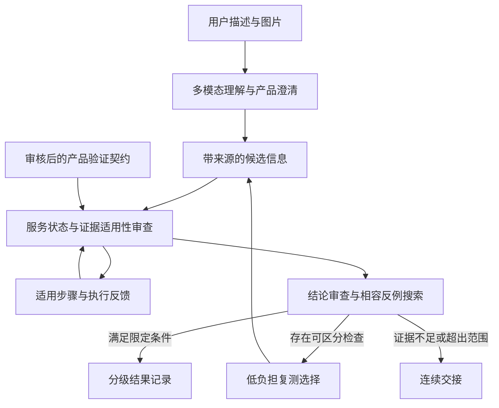

> 公开归档说明：本文保留原版本的研究和计划口径，不代表功能已经实现。当前状态见 [项目状态](status.md)，论文与技术依据见 [参考文献](references.md)。未公开的本机证据不作为公开可复核附件。

# 一步有据：面向远程售后的反例驱动主动验效系统

版本：v6，2026 年 9 月 20 日。状态：方案深化与受限机制核验阶段，真实多模态原型、实机与用户效果验证尚未完成。

## 一、赛题理解

售后服务的核心不是给出正确话术，而是帮助用户采取适当行动，并判断这些行动是否解决了问题。远程场景的难点是：用户报告完成不代表完整执行，图片显示改善不代表功能恢复，操作之前的证据也不一定能证明当前状态。

本项目面向不熟悉设备术语、操作时间有限的消费者，以及需要接续处理问题的一线客服。首版聚焦 S1 Pro 扫地机器人吸力下降，围绕有官方资料依据的两类排查方向和未知出口，形成从求助理解、逐步指导、结果验效到人工交接的连续服务。 [产品依据](https://service.eufy.com/article-description/What-should-I-do-if-my-S1-Pro-s-suction-becomes-weak)

**一句话方案：每当系统准备说“问题已解决”，先检查现有证据是否仍容得下“没有解决”的情况，再选择有用的复测或明确保留待验证状态。**

## 二、具体方案

### 核心功能一：理解求助，区分报告与实际状态

**做什么：** 接收自然描述与照片，识别产品候选、故障表现、已尝试步骤和用户当前能做什么。遇到型号歧义先澄清产品；遇到焦急表达先简短回应，再提供一个适用步骤。

**怎么做：** 多模态 AI 输出带来源的候选信息，系统结合产品目录和版本化技术资料核对。用户报告、图像局部观察与功能复测分别记录，不将“我已经清理了”直接转换为“清理正确且问题已解决”。每项操作都声明可能影响的状态，操作后重新审查相关依据，保留型号等仍适用信息。

**为什么这样做：** 远程服务无法直接观察完整执行过程。保留执行偏差与观察盲区，可以避免在错误前提上继续排障，同时减少无关信息的重复询问。情绪和时间限制用于调整表达、步骤长度和允许的取证方式，不降低安全标准。

### 核心功能二：寻找相容反例，选择下一项有效复测

**做什么：** 在形成服务结论前，检查是否仍有与现有证据一致、但目标未达到的情况。若存在，解释缺失依据并推荐能够区分这些情况的检查；没有安全可行的检查则不强行结案。

**怎么做：** 验效模块在审核过的小规模候选状态集合中搜索反例，并比较不同观察的区分能力与用户负担。相同照片或同一照片的文字识别结果不会被当作新的独立证明。检查改变了设备状态时先更新状态再规划；结果矛盾时暂停判断，不将矛盾压成“通过”。

**为什么这样做：** “外观看起来清洁”可能同时出现在功能已恢复和仍异常的设备上，再索取相同信息不一定有用。结论导向的选证把交互重点放在真正能改变判断的信息上，而非机械补全全部问题。

首版采用有限状态枚举和保守的检查排序，不依赖未经校准的模型置信度。模型负责理解开放输入和解释结构化结果，关键证据等级与结案条件由受控规则决定。

### 核心功能三：按证据等级记录结果，连续交接并复用

**做什么：** 明确区分用户反馈恢复、符合限定复测条件、待验证、需人工处理，以及交接草稿、提交回执和人工接管状态。

**怎么做：** 将产品知识、动作前提、观察局限、结果条件和未知出口封装为验证契约。接入时用反例检查结案规则是否缺少必要依据。运行时保存设备、证据、动作与规则版本，输出已确认事实、尝试记录、剩余问题和待补依据。

**为什么这样做：** 客服接手时能够知道哪些信息可靠、哪些仍需核实，而不是只收到一段语言摘要。新增产品复用同一验效与交接引擎，但产品安全规则、观察能力和功能复测规程必须重新审核。

## 三、技术架构

前端提供图片与文字输入、单步操作反馈、暂停恢复和结果展示；后端以显式状态机、事件存储与轻量验效模块协作。知识检索先限制产品与资料版本，再进行语义匹配与来源核对。模型调用失败时退回审核过的固定流程，不编造诊断。

系统保留“候选、确认、待验证”的区别；未经授权的接口不能调用，检索内容中的指令不能改变权限。涉及订单、质保和换货等业务时只生成建议或核对路径，最终处理遵守授权规则与人工确认。

## 四、创新与复用

**创新一：把服务结论本身作为验效对象。** 不仅判断下一步做什么，还明确现有观察能支持哪种结论，并以相容反例暴露尚未排除的问题。

**创新二：把执行偏差、证据变化与取证能力共同纳入交互。** 用户完成了多少、现有照片还能证明什么、当前能否进行功能复测，共同决定下一步；系统不把“多收集素材”直接等同于“更接近解决”。

**创新三：将结果条件与观察局限纳入产品接入。** 验证契约可以在上线前检查无依据放行路径，在运行时复用状态、验效、交接与评价机制，形成可核查的接入流程。

以上属于拟验证的场景机制与系统贡献。状态维护、主动判定、部分可观察规划和声明式执行已有研究基础，不单独宣称首创。项目优势需要在相同知识和权限条件下，与带复测和状态维护的强基线比较后确认。

## 五、价值与验收

| 对象 | 拟改善环节 | 如何检查 |
| --- | --- | --- |
| 用户 | 重复描述、重复拍照、无用操作及不明确结论 | 实际取证时间、无效步骤、放弃率与结果理解 |
| 一线客服 | 交接时信息失真与重新排查 | 关键事实完整性、待验证项准确性及接手后的重复询问 |
| 服务团队 | 过早结案和范围外承诺 | 分等级错误结案率，同时报告服务覆盖率 |
| 产品接入团队 | 配置缺少验证标准及迁移成本不透明 | 契约反例、审核工时、核心代码改动与回归结果 |

不能只用错误结案少来证明优势，因为全部转人工也能产生类似表象。需要同时比较覆盖率、用户负担和人工成本；如果短固定复测流程已经足够，就不增加复杂规划。

当前已通过合成 8 状态模型的 20 项单元测试，覆盖部分执行、旧证据、重复来源、矛盾状态和无效检查等情况。该结果只验证有限程序逻辑，不代表真实图片识别能力、维修成功率或用户效果。具体研究依据、机制定义和后续实验方案见配套 v6 复核报告。

## 六、24 小时原型范围

在约 3 人并行、模型接口可用且资料可审核的条件下，计划完成一个型号、一个故障族、两类文档支持方向和未知出口，形成理解、指导、验效与交接的完整受限流程。实际成员与能力仍需真实填写。

| 阶段 | 交付 |
| --- | --- |
| 0 至 4 小时 | 核对资料，确定动作边界、结论等级与服务契约 |
| 4 至 10 小时 | 完成文字/图片入口、产品澄清、候选与事件记录 |
| 10 至 16 小时 | 联通反例检查、下一步复测及结果分级 |
| 16 至 20 小时 | 完成失败交接、暂停恢复、冲突与幂等测试 |
| 20 至 24 小时 | 回放对照案例，修复问题并冻结演示版本 |

官方支持资料尚未提供本项目可直接采用的客观吸力恢复阈值。因此，在没有审核后的复测规程和真实采集条件时，真实会话只标注“用户反馈恢复”或“待核实”；模拟功能结果明确标注。未连接真实业务接口时仅生成交接草稿，不显示人工已接单。

首版不训练模型、不做全品类排障、不自动退款换货。第二产品的接入作为后续验证复用价值的任务，记录真实配置、审核与回归成本，不预先承诺零代码、零成本迁移。

## 七、核心演示

用户提出“S1 Pro 不吸了，明天要用”。系统先确认产品，结合图片与既往操作进入适用排查路径。用户反馈处理后提交一张外观改善的照片，系统解释：当前只能确认局部观察，仍不能排除功能异常，因此需要符合规程的功能反馈。

当该检查可执行时，系统继续收集限定结果并记录相应等级；用户无法执行时，保持待验证并带着现有证据交接；收到旧照片或部分执行反馈时，系统更新相关判断而不重复询问无关信息。

演示重点不是让每个案例都成功，而是让评委看到：**同样一张照片，系统为何不能贸然结案；下一项检查为何有用；无法验证时又如何真正把服务继续下去。**
